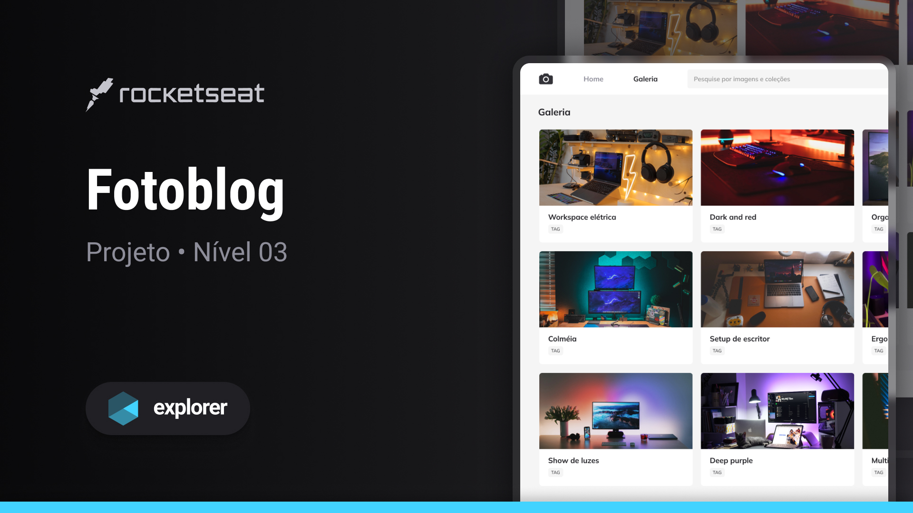

<h1 align="center"> Fotoblog </h1>

Programa exclusivo, promovido pela trilha Explorer da Rocketseat para ensino de tecnologias WEB. 

  <a href="#-tecnologias">Tecnologias</a>&nbsp;&nbsp;&nbsp;|&nbsp;&nbsp;&nbsp;
  <a href="#-projeto">Projeto</a>&nbsp;&nbsp;&nbsp;|&nbsp;&nbsp;&nbsp;
  <a href="#-layout">Layout</a>&nbsp;&nbsp;&nbsp;|&nbsp;&nbsp;&nbsp;
  <a href="#memo-licença">Licença</a>

  

 

  

## 🚀 Tecnologias

Esse projeto foi desenvolvido com as seguintes tecnologias:

- HTML e CSS
- Git e Github
- Figma

## 💻 Projeto

- 
O Fotoblog é uma aplicação web que apresenta diversas sugestões para a montagem de um setup confortável, ergonômico e sofisticado.  
 

- 
Este desafio tem por finalidade reforçar os conceitos de HTML e CSS, reforçando especificamente a importância do uso de propriedades modernas em CSS.  

- 
 Neste projeto, utilizamos propriedades importantes em sua composição, destacando-se o uso de Grid, variáveis de cor em CSS, unidades de medida flexíveis, escala de cores HSL, transições e animações CSS.   

 - [Acesse o projeto finalizado, online](https://bernardosa01.github.io//)

## 🔖 Layout

Você pode visualizar o layout do projeto através [DESSE LINK](https://www.figma.com/community/file/1256354844988182987). É necessário ter conta no [Figma](https://figma.com) para acessá-lo.

## :memo: Licença

Esse projeto está sob a licença MIT.

---

Feito com ♥ por Bernardo Sá :wave: [Participe da comunidade da Rocketseat!](https://discord.gg/rocketseat)